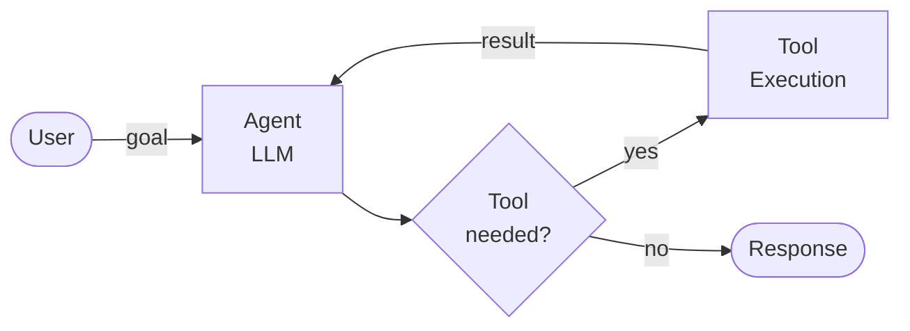
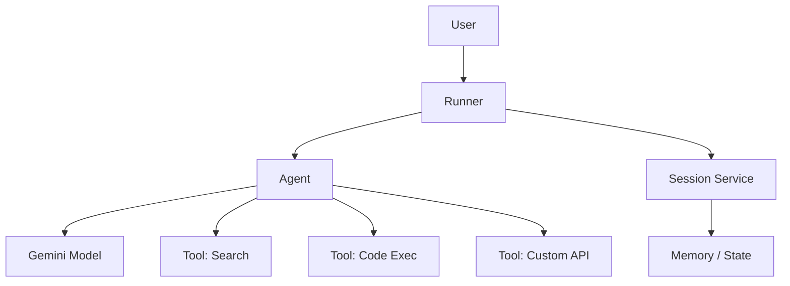
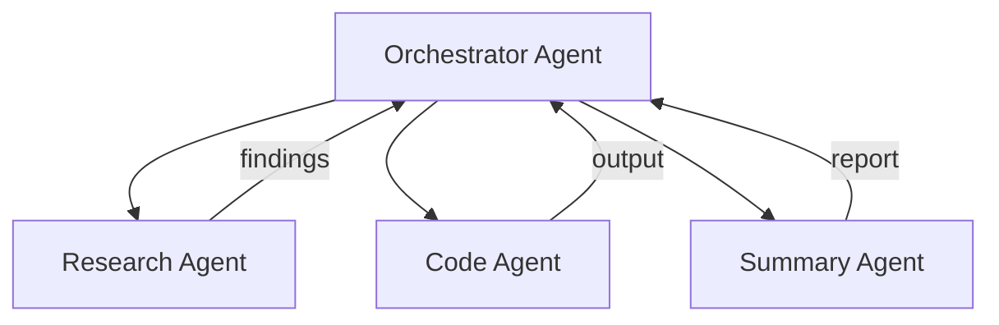

# Building Agentic Apps
## with Google ADK

<div class="pt-8 text-gray-400">
  Tech Meetup · May 2026
</div>

---

# Agenda

<v-clicks>

1. What are Agentic Apps?
2. The Agent Loop
3. Google ADK — what and why
4. Building your first agent
5. Tools & function calling
6. Multi-agent systems
7. Live demo

</v-clicks>

---

# Traditional Apps vs Agentic Apps

<div class="grid grid-cols-2 gap-8 mt-6">
<div class="border rounded p-4">

### Traditional

- Deterministic flow
- Human-defined steps
- `if/else` all the way down
- Predictable, brittle

</div>
<div class="border rounded p-4 border-blue-400">

### Agentic

- LLM reasons about next step
- Dynamically picks tools
- Self-corrects on failure
- Goal-oriented

</div>
</div>

---

# The Agent Loop



<div class="mt-4 text-sm text-gray-500">
The loop runs until the agent decides it has enough information to respond.
</div>

---

# Why Google ADK?

<v-clicks>

- Open source Python framework for building agents
- First-class support for **Gemini** models
- Built-in **multi-agent** orchestration
- Pluggable tool system — any Python function becomes a tool
- Supports **streaming**, **sessions**, and **memory**
- Works with Vertex AI for production deployment

</v-clicks>

---

# ADK Architecture



---

# Your First Agent

```python {1-4|6-12|14-16|all}
from google.adk.agents import Agent
from google.adk.runners import Runner
from google.adk.sessions import InMemorySessionService
import asyncio

# 1. Define the agent
root_agent = Agent(
    name="hello_agent",
    model="gemini-2.0-flash",
    description="A simple greeting agent",
    instruction="You are a friendly assistant. Be concise.",
)

# 2. Wire up the runner
session_service = InMemorySessionService()
runner = Runner(agent=root_agent, session_service=session_service)
```

---

# Adding Tools

```python {1-8|10-16|all}
from google.adk.agents import Agent

# Any Python function becomes a tool
def get_stock_price(ticker: str) -> dict:
    """Fetch current stock price for a ticker symbol."""
    # your real implementation here
    return {"ticker": ticker, "price": 182.50, "currency": "USD"}


root_agent = Agent(
    name="finance_agent",
    model="gemini-2.0-flash",
    instruction="Help users with stock information.",
    tools=[get_stock_price],  # ADK generates the schema from signature + docstring
)
```

<div class="mt-2 text-sm text-gray-500">
ADK inspects the function signature and docstring to generate the tool schema automatically.
</div>

---

# Multi-Agent Systems



<div class="grid grid-cols-2 gap-4 mt-4">
<div>

Each agent has a **specialized role** and its own set of tools.

</div>
<div>

The orchestrator **delegates subtasks** based on the goal.

</div>
</div>

---
layout: image-right
image: /images.jpeg
---

# Agentic Apps in the Wild

Real-world use cases where agents shine:

- Customer support with tool access
- Code review & generation pipelines
- Research & summarisation workflows
- Autonomous data processing

---
layout: center
---

# See It in Action

<video controls class="w-full rounded shadow-lg">
  <source src="/7490439-hd_1920_1080_30fps.mp4" type="video/mp4" />
</video>

---
layout: center
class: text-center
---

# Demo

<div class="text-2xl mt-4 text-gray-400">
  Live demo time
</div>

---
layout: center
class: text-center
---

# Thank you

<div class="mt-6 text-gray-400 text-xl">Questions?</div>

<div class="mt-8 text-sm text-gray-500">
  slides · github.com/yourname/repo
</div>
