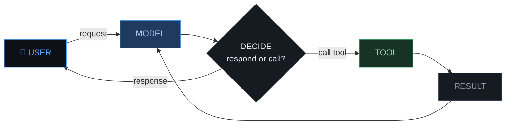

  
An agent is an LLM in a loop with tools.

---
layout: center
---

---
layout: center
---

<svg viewBox="0 0 840 170" width="100%" preserveAspectRatio="xMidYMid meet" style="font-family:system-ui,sans-serif">

  <!-- Axis line -->
  <line x1="60" y1="80" x2="780" y2="80" stroke="#e6edf3" stroke-width="2.5"/>
  <!-- Left cap -->
  <line x1="60" y1="68" x2="60" y2="92" stroke="#e6edf3" stroke-width="2.5"/>
  <!-- Right cap + arrowhead -->
  <polygon points="786,80 774,74 774,86" fill="#e6edf3"/>

  <!-- Left label -->
  <text x="60" y="30" fill="#e6edf3" font-size="13" font-weight="700" text-anchor="middle">SHORT LEASH</text>
  <text x="60" y="47" fill="#8b949e" font-size="10.5" text-anchor="middle">every step is approved</text>

  <!-- Right label -->
  <text x="780" y="30" fill="#e6edf3" font-size="13" font-weight="700" text-anchor="middle">LONG LEASH</text>
  <text x="780" y="47" fill="#8b949e" font-size="10.5" text-anchor="middle">acts and reports</text>

  <!-- Pills -->
  <rect x="20" y="92" width="158" height="28" rx="14" fill="#1e3a5f" stroke="#4a90d9" stroke-width="1.5"/>
  <text x="99" y="111" fill="#aecbfa" font-size="11" text-anchor="middle">GitHub Copilot autocomplete</text>

  <rect x="235" y="92" width="110" height="28" rx="14" fill="#173326" stroke="#3cad72" stroke-width="1.5"/>
  <text x="290" y="111" fill="#a8d5b5" font-size="11" text-anchor="middle">Cursor chat</text>

  <rect x="450" y="92" width="155" height="28" rx="14" fill="#2d1f00" stroke="#c47b2a" stroke-width="1.5"/>
  <text x="527" y="111" fill="#f0c87a" font-size="11" text-anchor="middle">Claude Code (today)</text>

  <rect x="672" y="92" width="140" height="28" rx="14" fill="#161b22" stroke="#374151" stroke-width="1.5" stroke-dasharray="4,2"/>
  <text x="742" y="111" fill="#6b7280" font-size="11" text-anchor="middle">autonomous / ?</text>

  <!-- Drift arrow -->
  <line x1="99" y1="138" x2="627" y2="138" stroke="#374151" stroke-width="1.5" stroke-dasharray="4,3"/>
  <polygon points="633,138 621,133 621,143" fill="#374151"/>
  <text x="365" y="153" fill="#374151" font-size="10" text-anchor="middle">~2 years</text>

</svg>

