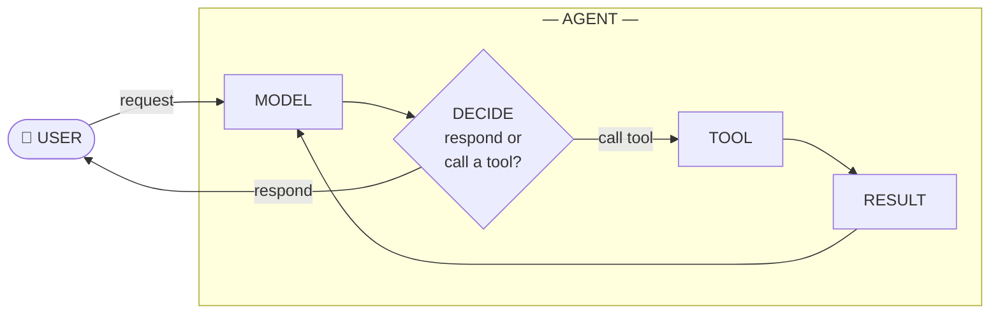

  
An agent is an LLM in a loop with tools.

<!--
## FLOW
- Deliver the working definition — one sentence, nothing added
- Name the frameworks as elaborations, not the thing itself
- → transition cue: "Let's look at the loop."

---

## SPOKEN
"Before we go anywhere, the working definition. An agent is an LLM in a loop with tools.

That's it. That's the whole thing. Every agent framework you've heard of — LangChain, ADK, the Anthropic SDK, whatever — they're all elaborations on this one sentence. LLM. In a loop. With tools.

Let's look at the loop."
-->

---
layout: center
class: mermaid-full
---

<!--
## FLOW
- Trace the request path: user sends, model receives
- Explain the DECIDE branch: respond goes out, call-a-tool continues the loop
- Surface the asymmetry: one request/response outside, many iterations inside
- Everything else is scaffolding around this loop
- → transition cue: "The interesting question is: how many times does it get to run before you check on it?"

---

## SPOKEN
"Here's the loop. A user sends a request. The model gets it, and it decides — respond directly back to the user, or call a tool. If it responds, we're done; that arrow goes back out. If it calls a tool, the tool runs, the result comes back, and the model gets to decide again with that new information. And again. And again. Until it decides to respond.

From the user's side, this looks like one request and one response. Inside, the loop might have spun three times, or thirty. That's the engine. Everything else we're going to talk about today is scaffolding around this loop.

The interesting question isn't how the loop works. The interesting question is: how many times does it get to run before you check on it?"
-->

---
layout: center
class: mermaid-full
---

<!--
## FLOW
- Introduce the leash metaphor: short leash left, long leash right
- Anchor to the audience's lived experience — they've been moving along this axis for two years
- Copilot: canonical short-leash, one token, one human decision
- Cursor: chat with context, bigger chunks, leash gets longer
- Claude Code: hand it a ticket, walk away, it runs its own loop
- Trust accumulated gradually — nobody made us do this
- [beat]
- Frame the dial as the core design question for building agents in products
- → Two shapes show up over and over. Let's look at them.

---

## SPOKEN
"I think about this as a leash. On the left, short leash — the model proposes, you approve, every single step. On the right, long leash — you give it a goal, it goes off, it comes back when it's done.

You already know this axis. You've been walking along it for two years.

Cast your mind back. The early days were Copilot autocomplete — grey text appearing at the end of your line, you hit tab or you didn't. That's about as short as a leash gets. One token suggestion, one human decision, repeat. We loved it. We did not let it touch anything else.

Then Cursor — chat in the editor, with context, asking it to write a function or refactor a file. Still you driving turn-by-turn, but each turn was a much bigger chunk of work. Leash got longer.

And now most of you, including me, give Claude Code or whatever else you use a ticket and walk away for ten minutes. The model is running its own loop in there — reading files, running tests, editing, running tests again — and you check in at the end. Long leash.

Nobody made us do that. We extended the leash ourselves, one small experiment at a time, as trust accumulated. Two years of small handoffs got us from autocomplete to autonomy.

[beat]

That same dial is what we're turning when we build agents into our own products. The whole design question is: for this feature, for this user, how long is the leash?

Two shapes show up over and over. Let's look at them."
-->
