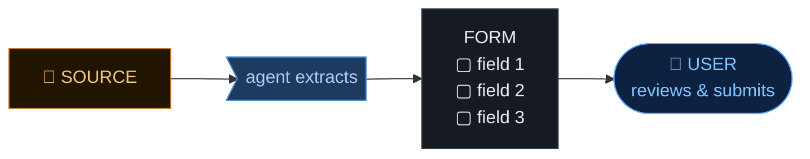

  
Two shapes

  
assistive &nbsp;·&nbsp; agentic

<!--
## CUE
- Two recurring shapes
- Name them; recognise them
- → naming drives decisions

---

## FLOW
- Introduce the recurring concept: two shapes that appear when building with agents
- Name them so the audience can recognise and categorise on their own
- → transition: naming them determines almost every other decision you make

---

## SPOKEN
"Two shapes show up over and over when you start building features
with agents in them. I want to give them names, because once you can
name them, you can tell which one you're looking at — and that
determines almost every other decision you make."
-->

---

  

  
prefill a form from a source

  

  

    <video class="panel-video" :src="'/7490439-hd_1920_1080_30fps.mp4'" loop muted playsinline controls />
  

  
the user is still driving

<!--
## CUE
- Shape one: assistive
- Source → agent → form → user
- Pattern everywhere
- [advance panel — beat]
- Real product, live
- Still filling a form
- → short leash; reframe next

---

## FLOW
- Name and introduce shape one: assistive
- Describe the generic pattern — source, agent, form, user reviews and submits
- Call out that this pattern appears everywhere once you see it
- [advance to bottom panel — beat]
- Ground it in the real product already built and in production
- Explain what the user is actually doing: filling out a form, just easier
- Land the key phrase: short leash, user sees every output
- → transition: the punchline reframe coming next

---

## SPOKEN
"Shape one. Assistive.
Generic version first. The user is doing something on a screen.
There's a source — a document, a description, some input — and there's
a destination, usually a form. The agent's job is to look at the
source, extract what matters, and prefill the form so the user doesn't
have to. The user reviews, fixes anything wrong, and submits.
That's the pattern. Prefill from a source. Once you see it, you'll
notice it everywhere — onboarding flows, expense reports, KYC
intakes, ticket triage.
[advance to bottom panel — beat]
And we've already built one. This is [tool name]. It reads incoming
customer documents, pulls out the fields we need, drops them into
the system. The analyst checks the extraction, fixes anything wrong,
and submits.
It feels like an agent, and technically it is — there's a model,
there are tools, there's a loop running somewhere behind this UI. But
notice what the user is actually doing: they're filling out a form.
The agent just made the form much easier to fill out.
Short leash. The user sees every output, approves every field, presses
every button."
-->

---
layout: center
---

  
You're not building an agent here. You're building a tool.

<!--
## CUE
- Assistive = tool, not agent
- Tools are fine; don't over-engineer
- [beat]
- Short leash wastes capability
- Leash for user's goal
- → the hour is the product

---

## FLOW
- Deliver the reframe: assistive = tool, not agent
- Acknowledge tools are valuable; the mistake is over-engineering them as agents
- [beat]
- Introduce the limitation of short-leash tools: they waste LLM capability
- Reframe the reason to extend the leash: the user's goal, not showing off the model
- The hour saved is the product
- → transition: sometimes the leash needs to be longer, and the shape changes

---

## SPOKEN
"Here's the reframe. When you're building something this assistive —
short leash, user driving — you're not really building an agent.
You're building a tool. A very smart tool, sure. A tool that happens
to have a language model inside it. But functionally, in terms of how
you should think about it, design it, test it, ship it — it's a tool.
And that's fine. Tools are great. Most of what you build will be tools.
The mistake is calling it an agent and then over-engineering it like
one.
[beat]
But here's the thing. A short-leashed tool only uses a sliver of what
modern LLMs can actually do. These models can plan, sequence actions
across systems, recover from errors, decide when they have enough
information and when they need more. If every step you let it take
has to be approved one at a time, you're using a Formula 1 engine
to drive in a school zone. Fine sometimes, but you're leaving the
machine's actual capability on the floor.
And — more importantly — you're leaving the user's work on the
floor. The reason to extend the leash isn't to show off the model.
It's because the user has a goal, and right now they're spending an
hour doing the six clicks between them and that goal. Make the leash
longer, the six clicks collapse, the user gets their hour back. That
hour is the product.
So sometimes the leash does need to be longer. And the shape changes."
-->

---

Cmd+K in a case management app

  <!-- Blurred background: faded case-management UI -->
  

    

      

        

        

        

        

        

        

      

      

        

        

        

        

        

          

          

          

          

          

          

        

      

    

  

  <!-- Command palette (foreground) -->
  

    
⌘K &nbsp;—&nbsp; case management

    

      pull this customer's account, find the disputed transaction, 
      check fraud patterns, draft a response, hold the card if needed, 
      generate a PDF summary▌
    

    
↵ to run

  

<!--
## CUE
- Shape two: agentic
- Six actions, four systems, one conditional
- Form would ship next year
- → one sentence, agent sequences
- Long leash; "hold card" = short inside

---

## FLOW
- Name and introduce shape two: agentic
- Walk through what's in the Cmd+K prompt — six actions, four systems, a conditional
- Contrast with the form-based approach: wizard, state machine, ship next year
- Land the key insight: one sentence, agent figures out the sequence
- Note the tension: long leash overall but "hold the card" needs a short leash inside
- → transition: the dogs recap slide crystallises both shapes side by side

---

## SPOKEN
"Shape two. Agentic. Same kind of internal app — case management, the
user is a complaints analyst. But instead of a form, there's a command
bar. Cmd+K, type what you want.
Look at what's in this prompt. Pull this customer's account. Find the
disputed transaction. Check fraud patterns. Draft a response. Hold the
card if needed. Generate a PDF summary.
That's not one action. That's six. Across at least four backend systems.
With a conditional in the middle.
If you tried to build this as a form, the form would have six steps
and a wizard and a state machine and you'd ship it next year. As an
agentic feature, the user types one sentence and the agent figures out
the sequence.
Long leash overall — the user isn't approving each step. But notice
the hold the card bit. That one needs a short leash inside the long
one. That tension is where the interesting design questions live."
-->

---

  <!-- ASSISTIVE row -->
  

    
Assistive

    

      
    

    

      <b>user drives</b>
      <b>short leash</b>
      you're building <b>a tool</b>
    

  

  <!-- AGENTIC row -->
  

    
Agentic

    

      
    

    

      <b>user delegates</b>
      <b>long leash</b> (mostly)
      you're building <b>an agent</b>
    

  

<!--
## CUE
- Dog metaphor: two shapes
- [top] sit/come — tool
- [bottom] behave — agent
- Goal = natural unit → agent
- → Cmd+K, next nine minutes

---

## FLOW
- Introduce the dog metaphor to crystallise both shapes
- [gesture at top row] Assistive: short leash, user drives every step, you're building a tool
- [gesture at bottom row] Agentic: long leash, user delegates the goal, you're building an agent
- Explain when to reach for each: most features are the top dog, but when the natural unit is a goal, reach for the agent
- → The Cmd+K example is what I want to dig into for the next nine minutes.

---

## SPOKEN
"So here's how I think about it.
[gesture at top row] Assistive — you tell the dog to sit. It sits.
You tell it to come. It comes. Short leash. User drives every step.
You're building a tool.
[gesture at bottom row] Agentic — you tell the dog to behave. It
runs around, sniffs things, hopefully doesn't bite anyone. Long leash.
User delegates the goal. You're building an agent.
Most features you build will be the dog on top. That's fine. But when
the natural unit of work for the user is a goal and not a step — when
'behave' is the right instruction — that's when you reach for an
agent.
The Cmd+K example is what I want to dig into for the next nine minutes.
Five problems you'll hit when you build something like that. All five
have analogues you already know."
-->
