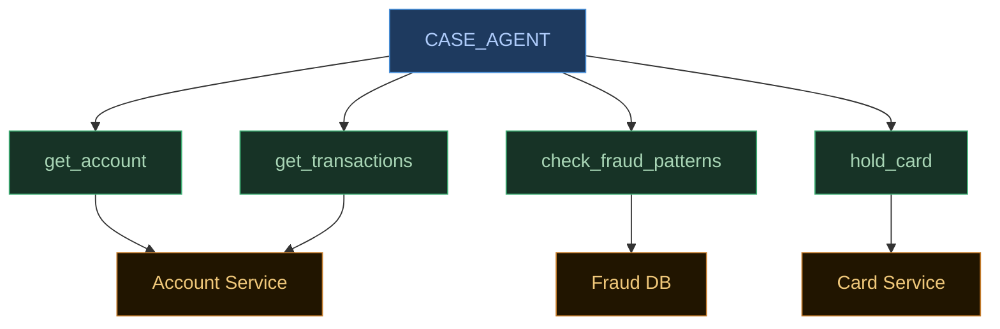
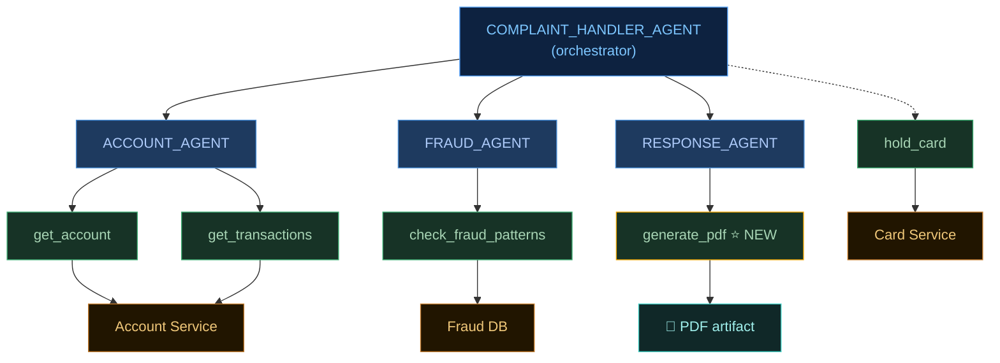
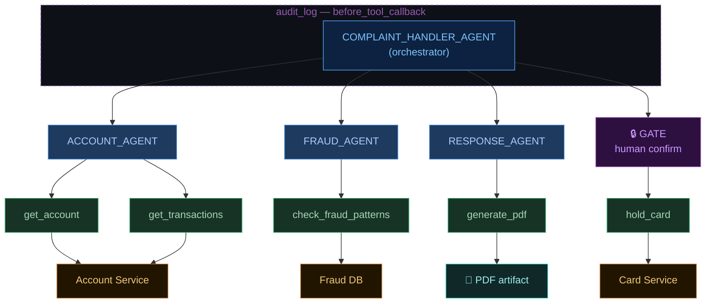
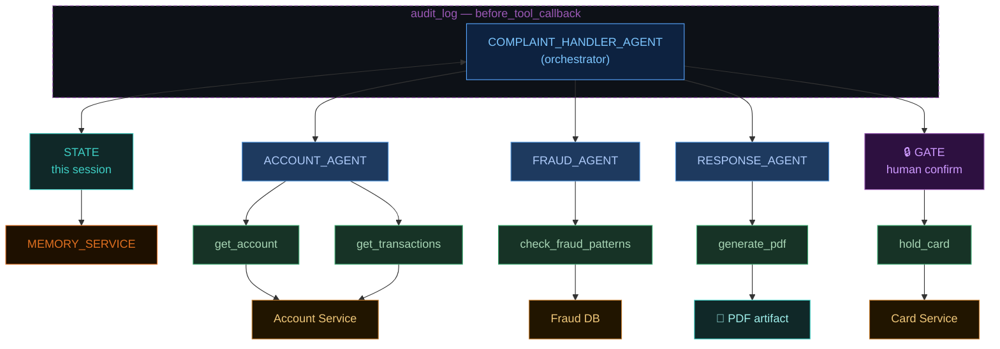
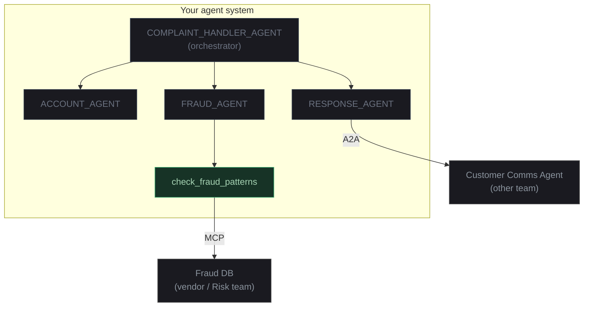

<div class="min-center">
  <p class="section-heading">Five problems</p>
  <p class="section-sub">tools &nbsp;·&nbsp; orchestration &nbsp;·&nbsp; callbacks &nbsp;·&nbsp; state &nbsp;·&nbsp; protocols</p>
</div>

---
class: problem-slide-wrap
---

<div class="problem-slide">
  <div class="title-bar">
    <span class="tb-l">P1 — Tools</span>
    <span class="tb-r">service calls / adapter pattern</span>
  </div>
</div>



```python {8}
def hold_card(card_id: str, reason: str) -> dict:
    """Place a temporary hold on a card. Use when fraud is suspected."""
    return card_service.hold(card_id, reason)

case_agent = LlmAgent(
    model="gemini-2.5-flash",
    name="case_agent",
    tools=[get_account, get_transactions, check_fraud_patterns, hold_card],
)
```

---
class: problem-slide-wrap
---

<div class="problem-slide">
  <div class="title-bar">
    <span class="tb-l">P2 — Sub-agents</span>
    <span class="tb-r">service composition / saga</span>
  </div>
</div>



```python {4}
complaint_handler_agent = LlmAgent(
    model="gemini-2.5-flash",
    name="complaint_handler",
    sub_agents=[account_agent, fraud_agent, response_agent],
    tools=[hold_card],
)
```

---
class: problem-slide-wrap
---

<div class="problem-slide">
  <div class="title-bar">
    <span class="tb-l">P3 — Callbacks</span>
    <span class="tb-r">AOP / interceptors / middleware</span>
  </div>
</div>



```python {6,8,19}
# Cross-cutting: log every tool call. Callback shape.
def audit_tool_call(tool, args, tool_context):
    logger.info(f"{tool.name} called with {args}")

# Targeted: gate a specific tool on human approval.
@long_running_tool
def hold_card(card_id: str, reason: str):
    approval = yield {
        "type": "approval_request",
        "card_id": card_id,
        "reason": reason,
    }
    if not approval["approved"]:
        return {"status": "denied", "by": approval["user"]}
    return card_service.hold(card_id, reason)

complaint_handler_agent = LlmAgent(
    ...
    before_tool_callback=audit_tool_call,
    tools=[hold_card],
)
```

---
class: problem-slide-wrap
---

<div class="problem-slide">
  <div class="title-bar">
    <span class="tb-l">P4 — Sessions &amp; memory</span>
    <span class="tb-r">request scope / database</span>
  </div>
</div>



```python {2,5-9}
# Inside a tool — short-term state for this conversation
tool_context.state["draft_response"] = text

# After resolution — keep what's useful next time
memory_service.add(
    customer_id=session.state["customer_id"],
    summary=session.state["resolution_summary"],
    tags=["fraud_hold", "disputed_transaction"],
)
```

---
class: dia-slide
---

<div class="title-bar">
  <span class="tb-l">P5 — Protocols</span>
  <span class="tb-r">designed for LLMs / OpenAPI for agents</span>
</div>



---
class: dia-slide
---

<div class="title-bar">
  <span class="tb-l">Events</span>
  <span class="tb-r">the bus underneath</span>
</div>
<div class="dia-full">
  <svg viewBox="0 0 920 370" width="100%" height="100%" preserveAspectRatio="xMidYMid meet" style="font-family:system-ui,sans-serif">
    <defs>
      <marker id="ah46" markerWidth="7" markerHeight="5" refX="6" refY="2.5" orient="auto">
        <polygon points="0 0,7 2.5,0 5" fill="#6b7280"/>
      </marker>
    </defs>

    <!-- ── TOP: miniaturized schematic (~25% of slide) ── -->
    <g opacity="0.45" transform="scale(0.55) translate(170, 10)">
      <!-- Orchestrator -->
      <rect x="270" y="10" width="220" height="38" rx="6" fill="#0d2240" stroke="#58a6ff" stroke-width="2"/>
      <text x="380" y="33" fill="#7dc6ff" font-size="16" text-anchor="middle">Orchestrator</text>
      <!-- Sub-agents -->
      <rect x="30" y="80" width="140" height="34" rx="5" fill="#1e3a5f" stroke="#4a90d9" stroke-width="1.5"/>
      <text x="100" y="101" fill="#aecbfa" font-size="13" text-anchor="middle">Account</text>
      <rect x="245" y="80" width="140" height="34" rx="5" fill="#1e3a5f" stroke="#4a90d9" stroke-width="1.5"/>
      <text x="315" y="101" fill="#aecbfa" font-size="13" text-anchor="middle">Fraud</text>
      <rect x="460" y="80" width="160" height="34" rx="5" fill="#1e3a5f" stroke="#4a90d9" stroke-width="1.5"/>
      <text x="540" y="101" fill="#aecbfa" font-size="13" text-anchor="middle">Response</text>
      <!-- audit band hint -->
      <rect x="263" y="3" width="230" height="52" rx="8" fill="none" stroke="#9b59b6" stroke-width="1.5" stroke-dasharray="4,3"/>
      <!-- GATE -->
      <rect x="640" y="12" width="60" height="34" rx="5" fill="#2d1040" stroke="#9b59b6" stroke-width="1.5"/>
      <text x="670" y="33" fill="#ce9aff" font-size="12" text-anchor="middle">🔒</text>
      <!-- hold_card tool -->
      <rect x="720" y="12" width="90" height="34" rx="4" fill="#173326" stroke="#3cad72" stroke-width="1.5"/>
      <text x="765" y="33" fill="#a8d5b5" font-size="12" text-anchor="middle">hold_card</text>
    </g>

    <!-- Vertical dotted drop-lines from schematic to event stream -->
    <line x1="210" y1="88" x2="210" y2="148" stroke="#374151" stroke-width="1" stroke-dasharray="3,3"/>
    <line x1="415" y1="88" x2="415" y2="148" stroke="#374151" stroke-width="1" stroke-dasharray="3,3"/>
    <line x1="644" y1="88" x2="644" y2="148" stroke="#374151" stroke-width="1" stroke-dasharray="3,3"/>

    <!-- ── MIDDLE: EVENT STREAM ── -->
    <rect x="10" y="148" width="900" height="72" rx="8" fill="#0d1a26" stroke="#30363d" stroke-width="1.5"/>
    <text x="16" y="141" fill="#8b949e" font-size="10" font-weight="600" letter-spacing="2">EVENT STREAM</text>

    <!-- Event tokens -->
    <rect x="18" y="160" width="88" height="24" rx="12" fill="#1c2128" stroke="#374151" stroke-width="1"/>
    <text x="62" y="176" fill="#8b949e" font-size="9" text-anchor="middle">user_message</text>
    <line x1="106" y1="172" x2="118" y2="172" stroke="#6b7280" stroke-width="1.5" marker-end="url(#ah46)"/>

    <rect x="120" y="160" width="82" height="24" rx="12" fill="#1e3a5f" stroke="#4a90d9" stroke-width="1"/>
    <text x="161" y="176" fill="#aecbfa" font-size="9" text-anchor="middle">llm_request</text>
    <line x1="202" y1="172" x2="214" y2="172" stroke="#6b7280" stroke-width="1.5" marker-end="url(#ah46)"/>

    <rect x="216" y="160" width="88" height="24" rx="12" fill="#173326" stroke="#3cad72" stroke-width="1"/>
    <text x="260" y="172" fill="#a8d5b5" font-size="9" text-anchor="middle">tool_call</text>
    <text x="260" y="182" fill="#a8d5b5" font-size="8" text-anchor="middle">[get_account]</text>
    <line x1="304" y1="172" x2="316" y2="172" stroke="#6b7280" stroke-width="1.5" marker-end="url(#ah46)"/>

    <rect x="318" y="160" width="82" height="24" rx="12" fill="#173326" stroke="#3cad72" stroke-width="1"/>
    <text x="359" y="176" fill="#a8d5b5" font-size="9" text-anchor="middle">tool_response</text>
    <line x1="400" y1="172" x2="412" y2="172" stroke="#6b7280" stroke-width="1.5" marker-end="url(#ah46)"/>

    <rect x="414" y="160" width="82" height="24" rx="12" fill="#1e3a5f" stroke="#4a90d9" stroke-width="1"/>
    <text x="455" y="176" fill="#aecbfa" font-size="9" text-anchor="middle">llm_request</text>
    <line x1="496" y1="172" x2="508" y2="172" stroke="#6b7280" stroke-width="1.5" marker-end="url(#ah46)"/>

    <rect x="510" y="160" width="90" height="24" rx="12" fill="#2d1040" stroke="#9b59b6" stroke-width="1"/>
    <text x="555" y="172" fill="#ce9aff" font-size="9" text-anchor="middle">tool_call</text>
    <text x="555" y="182" fill="#9b59b6" font-size="8" text-anchor="middle">[hold_card]</text>
    <line x1="600" y1="172" x2="612" y2="172" stroke="#6b7280" stroke-width="1.5" marker-end="url(#ah46)"/>

    <rect x="614" y="156" width="100" height="32" rx="6" fill="#2d1040" stroke="#9b59b6" stroke-width="2"/>
    <text x="664" y="170" fill="#ce9aff" font-size="9" font-weight="700" text-anchor="middle">approval_req</text>
    <text x="664" y="182" fill="#f0a500" font-size="9" text-anchor="middle">⏸ paused</text>
    <line x1="714" y1="172" x2="726" y2="172" stroke="#6b7280" stroke-width="1.5" stroke-dasharray="4,3" marker-end="url(#ah46)"/>

    <rect x="728" y="160" width="92" height="24" rx="12" fill="#173326" stroke="#3cad72" stroke-width="1"/>
    <text x="774" y="172" fill="#a8d5b5" font-size="9" text-anchor="middle">approval_resp</text>
    <text x="774" y="182" fill="#3cad72" font-size="8" text-anchor="middle">▶ resumed</text>
    <line x1="820" y1="172" x2="832" y2="172" stroke="#6b7280" stroke-width="1.5" marker-end="url(#ah46)"/>

    <rect x="834" y="160" width="68" height="24" rx="12" fill="#1c2128" stroke="#58a6ff" stroke-width="1.5"/>
    <text x="868" y="176" fill="#58a6ff" font-size="9" text-anchor="middle">final_resp</text>

    <!-- ── BOTTOM: three property labels ── -->
    <text x="155" y="252" fill="#e6edf3" font-size="14" font-weight="600" text-anchor="middle">observability</text>
    <text x="155" y="270" fill="#8b949e" font-size="10" text-anchor="middle">every action is already logged</text>

    <line x1="310" y1="240" x2="310" y2="280" stroke="#30363d" stroke-width="1"/>

    <text x="460" y="252" fill="#e6edf3" font-size="14" font-weight="600" text-anchor="middle">persistence</text>
    <text x="460" y="270" fill="#8b949e" font-size="10" text-anchor="middle">state is a projection of events</text>

    <line x1="610" y1="240" x2="610" y2="280" stroke="#30363d" stroke-width="1"/>

    <text x="765" y="252" fill="#e6edf3" font-size="14" font-weight="600" text-anchor="middle">resumability</text>
    <text x="765" y="270" fill="#8b949e" font-size="10" text-anchor="middle">pause → persist → resume anywhere</text>

    <!-- Separator line -->
    <line x1="20" y1="238" x2="900" y2="238" stroke="#30363d" stroke-width="1"/>

    <!-- Drop lines from event tokens to label areas -->
    <line x1="161" y1="220" x2="155" y2="238" stroke="#374151" stroke-width="1" stroke-dasharray="2,2"/>
    <line x1="460" y1="220" x2="460" y2="238" stroke="#374151" stroke-width="1" stroke-dasharray="2,2"/>
    <line x1="664" y1="220" x2="765" y2="238" stroke="#374151" stroke-width="1" stroke-dasharray="2,2"/>
  </svg>
</div>
