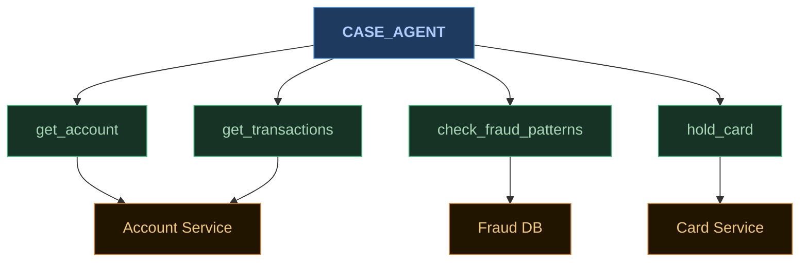
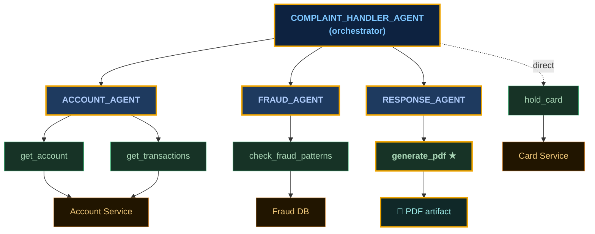
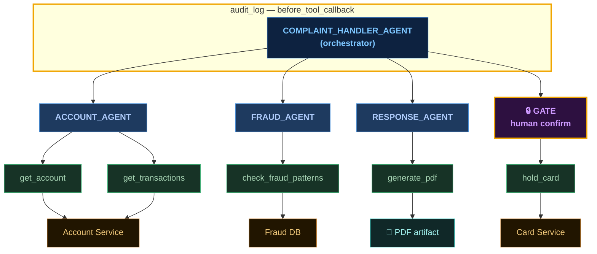
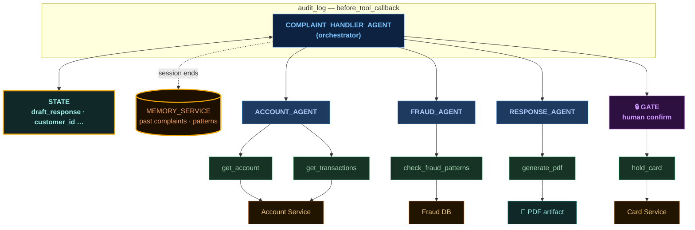
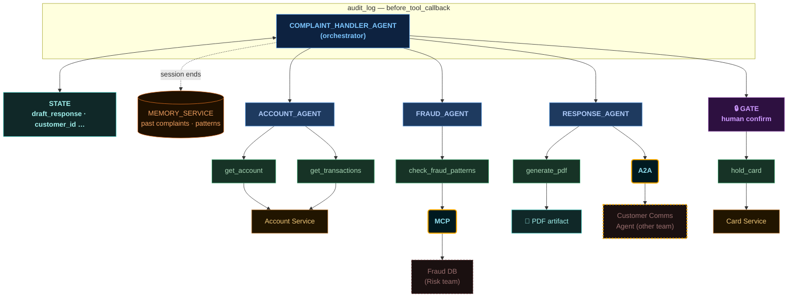
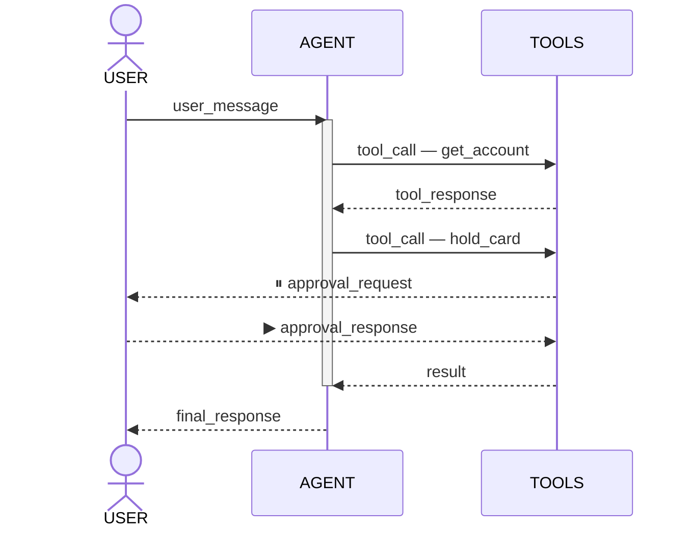

<div class="min-center">
  <p class="section-heading">Six problems</p>
  <p class="section-sub">act &nbsp;·&nbsp; decompose &nbsp;·&nbsp; intercept &nbsp;·&nbsp; remember &nbsp;·&nbsp; connect &nbsp;·&nbsp; observe</p>
  <p class="section-note">Google Agent Development Kit</p>
</div>

<!--
## CUE
- Six problems, six verbs
- Google ADK as the vehicle
- Each problem: agent term + software analogue
- → first verb: act

---

## FLOW
- Introduce the six-problem frame for the Cmd+K feature build
- [gesture at the verbs — beat] six things you need the agent to do: act, decompose, intercept, remember, connect, observe
- Each has an agent-land name and a regular-software analogue — we'll see both on every slide
- Name-drop Google ADK: Google's open-source agent framework; patterns apply elsewhere, names may differ
- → transition to Problem one: act — the agent needs to do something

---

## SPOKEN
Okay. The Cmd+K feature. If you actually sit down to build this thing, six problems will hit you in roughly this order.
[gesture at the verbs — beat]
Act. Decompose. Intercept. Remember. Connect. Observe. Six things you need your agent to be able to do.
Each one has a name in agent-land, and each one has an analogue in the software you already write. I'm going to give you both every time — because once you see the analogy, the agent version stops feeling weird.
We'll work through all six using Google ADK — Google's open-source agent development framework, released earlier this year. If you've used LangGraph, CrewAI, or something else, the patterns are the same; the API surface will look slightly different.
Problem one. The agent needs to act.
-->

---
class: problem-slide-stack
---

<div class="title-bar">
  <span class="tb-l">P1 — the agent needs to act</span>
  <span class="tb-r">tools · adapter pattern</span>
</div>



```python {all|1-3|2|8}
def hold_card(card_id: str, reason: str) -> dict:
    """Place a temporary hold on a card. Use when fraud is suspected."""
    return card_service.hold(card_id, reason)

case_agent = LlmAgent(
    model="gemini-2.5-flash",
    name="case_agent",
    tools=[get_account, get_transactions, check_fraud_patterns, hold_card],
)
```

<!--
## CUE
- Adapter pattern, service calls
- Four tools, three services
- Agent picks what it needs
- Function → tool via list
- Docstring is LLM contract
- Text, data, artifacts
- → one agent, too much

---

## FLOW
- Introduce tools as the adapter pattern — service calls you've written your whole career
- Introduce case_agent diagram: four tools, three backend services
- [glance at diagram — beat] agent calls whichever tool it needs
- [glance at snippet — beat] plain Python function becomes a tool via tools= list
- Docstring as LLM contract, not a human comment
- Tools can return text, structured data, or artifacts
- → transition: this one agent is fine for now, but it's about to be doing too much

---

## SPOKEN
Problem one. The agent needs to actually do something — pull accounts, query the fraud DB, hold cards. These are service calls. You've been writing these your whole career.
In agent-land they're called tools, but it's the adapter pattern. The agent doesn't know what HTTP is or what your fraud DB is; it knows there are functions it can call, and each function knows how to talk to its real system. Same way a service client wraps a REST API today.
[glance at diagram — beat] Meet our case_agent. Four tools, three backend services. The agent calls whichever one it needs based on what the user asked for.
[glance at snippet — beat]
Two things. One: a plain Python function becomes a tool the moment you put it in that tools= list. No special base class, no decorator. If you can write a function, you can write a tool.
Two — that docstring isn't a comment for humans. It's a contract for the LLM. The model reads it to decide when to call this function. 'Place a temporary hold on a card. Use when fraud is suspected.' That sentence is what makes the agent reach for hold_card instead of guessing.
Tools don't only return text, by the way. Structured data, or artifacts — a PDF, an image, a file. Same shape as a multipart response.
Problem two: this one agent is fine for now, but it's about to be doing too much.
-->

---
class: problem-slide-stack
---

<div class="title-bar">
  <span class="tb-l">P2 — one agent, too many concerns</span>
  <span class="tb-r">sub-agents · service composition</span>
</div>



```python {all|4|5}
complaint_handler_agent = LlmAgent(
    model="gemini-2.5-flash",
    name="complaint_handler",
    sub_agents=[account_agent, fraud_agent, response_agent],
    tools=[hold_card],
)
```

<style scoped>
.mermaid { width: 80% !important; }
</style>

<!--
## CUE
- Too much → decompose
- Rename: now orchestrator
- Same tools, regrouped; hold_card stays
- **★ point at generate_pdf — "response agent just got a new tool"**
- No logic, LLM decides
- Contrast explicit saga
- → about that card hold

---

## FLOW
- Problem: one agent doing too much — service composition instinct kicks in
- Rename agent to orchestrator; explain the role change
- [point at diagram — beat] Same four tools regrouped under three specialists; **[point at ★ generate_pdf] response agent just got a new tool — it spits out the PDF artifact**; hold_card stays on orchestrator — on purpose
- [glance at snippet — beat] No orchestration logic — the LLM decides the sequence at runtime
- Contrast with explicit saga (Camunda, Step Functions)
- → transition: About that card hold

---

## SPOKEN
Problem two. That case_agent from a minute ago is going to drown if it has to know everything about accounts, everything about fraud, and everything about drafting customer communications. Big prompts, conflicting instructions, no separation of concerns.
What you actually want is service composition. Same instinct you have today: when one service is doing too much, you break it into smaller services and put something in front to coordinate. Here, that 'something in front' is itself an agent — an orchestrator. We're renaming the agent because its role just changed: it's not doing the work directly anymore, it's coordinating others.
[point at diagram — beat]
Look at what changed. Same four tools as before, they didn't go anywhere. We just regrouped them under three specialists. Account agent knows the account systems. Fraud agent knows the fraud DB. Response agent knows how to draft messages — and it just got a new tool, generate_pdf, which spits out that artifact at the bottom.
Notice one tool that did not get pulled into a sub-agent: hold_card. Still hanging directly off the orchestrator. That positioning is on purpose.
[glance at snippet — beat]
And here's the genuinely different thing about this code. There is no orchestration logic. No if fraud_detected then call response_agent. The orchestrator doesn't describe the saga; it just declares its participants. The LLM inside the orchestrator figures out the sequence at runtime, based on what the user asked and what each sub-agent returns.
If you've written a saga before — Camunda, Step Functions — you know there's a flow diagram somewhere. Here there isn't. The flow is in the model's head, one decision at a time. That's the power and that's the discomfort.
Problem three. About that card hold.
-->

---
class: problem-slide-stack
---

<div class="title-bar">
  <span class="tb-l">P3 — audit every call, gate the risky ones</span>
  <span class="tb-r">callbacks · AOP / middleware</span>
</div>



```python {all|1-2,9|4-5,10}
def audit_tool_call(tool, args, tool_context):
    logger.info(f"{tool.name} called with {args}")

def hold_card(card_id: str, reason: str) -> dict:
    return card_service.hold(card_id, reason)

complaint_handler_agent = LlmAgent(
    ...
    before_tool_callback=audit_tool_call,
    tools=[FunctionTool(func=hold_card, require_confirmation=True)],
)
```

<!--
## CUE
- Always log, never without asking
- AOP / middleware framing
- Audit band: sync, global
- GATE: one flag, agent pauses until analyst says yes
- Short leash inside long one
- Two mechanisms, one idea
- Other scopes, same family
- → agent needs to remember

---

## FLOW
- Introduce cross-cutting concerns: "always log this," "never do that without asking first"
- Frame as AOP / middleware — attach behavior around a function without changing the function
- [point at audit band — beat] before_tool_callback: synchronous, fires before every tool call globally
- [point at GATE — beat] hold_card needs human approval — require_confirmation=True on the FunctionTool; ADK pauses the run and surfaces the request; analyst approves or denies; run resumes
- Short leash inside the long one: agent is free to pull data but can't freeze a card without a person saying yes
- [glance at snippet — beat] Two mechanisms, one idea — callback for synchronous/everywhere; require_confirmation for async/targeted
- Rest of ADK callback surface falls into place: different scopes, same idea
- → transition: Problem four. The agent needs to remember things.

---

## SPOKEN
Problem three. We need a way to say 'always log this' and 'never do that without asking first.' These are cross-cutting concerns. In every framework you've ever used — Spring AOP, Express middleware, request interceptors — there's a way to attach behavior around a function without changing the function itself.
Agent frameworks have the same idea, but here it splits into two shapes depending on what you're doing.
[point at audit band — beat] Up here, on the orchestrator, I've attached an audit_tool_call callback. ADK calls this a before_tool_callback. It runs synchronously before every tool call, no matter which tool, no matter which sub-agent triggered it. Every action the agent takes, we have a log line. Same shape as a global interceptor.
[point at GATE — beat] And down here, on hold_card specifically, I need something different. The agent can't just log and proceed — it has to stop, ask a human, and wait for an answer that might come two minutes later. A synchronous callback is the wrong tool for that.
ADK has a built-in primitive for exactly this: require_confirmation=True on the FunctionTool. One flag. When the agent tries to call hold_card, ADK automatically pauses the run, surfaces the approval request to your UI, and only executes the actual card hold once an analyst says yes. The function itself stays clean — no pending status, no generator logic. This is the short leash inside the long one — the agent can pull accounts, check fraud, draft responses on its own, but it cannot freeze a real customer's card without a person saying yes.
[glance at snippet — beat]
Two mechanisms, one idea. Both are middleware. Both are 'attach behavior to a tool call.' The callback is the synchronous, applied-to-everything flavor; require_confirmation is the async, applied-to-a-specific-tool flavor. Once you see them as the same family, the rest of the ADK surface — before_agent, after_agent, before_model — falls into place. Different scopes, same idea.
Problem four. The agent needs to remember things.
-->

---
class: problem-slide-stack
---

<div class="title-bar">
  <span class="tb-l">P4 — the agent needs to remember</span>
  <span class="tb-r">sessions &amp; memory · request scope / DB</span>
</div>



```python {all|1-2|4-9}
# Inside a tool — short-term state for this conversation
tool_context.state["draft_response"] = text

# After resolution — keep what's useful next time
memory_service.add(
    customer_id=session.state["customer_id"],
    summary=session.state["resolution_summary"],
    tags=["fraud_hold", "disputed_transaction"],
)
```

<style scoped>
.mermaid { width: 78% !important; }
</style>

<!--
## CUE
- Two kinds of memory
- State: request scope, gone after
- STATE box: draft mid-flight
- memory_service: cross-session DB
- MEMORY_SERVICE: past patterns
- Session-ends arrow = boundary
- state write vs. memory add
- → one more, then zoom out

---

## FLOW
- Two kinds of memory: short-term (request scope) and long-term (database)
- Kind one: state — lives for the conversation, then gone; same as request-scoped bean
- [point at STATE box — beat] draft written mid-conversation, needed two tool calls later
- Kind two: memory_service — separate service, cross-session; same as a database
- [point at MEMORY_SERVICE box — beat] cross-session facts: past complaints, fraud hold history
- The "session ends" arrow is the whole game — you decide what crosses the boundary
- [glance at snippet — beat] tool_context.state for mid-conversation writes; memory_service.add for what's worth keeping
- → transition: One more problem, and then we zoom out.

---

## SPOKEN
Problem four. The agent needs to remember things. Two kinds of things, actually — and that's the whole lesson on this slide.
Kind one: short-term. The response agent drafts a reply. Two tool calls later, the orchestrator needs to attach that draft to a PDF. Where did the draft go in the meantime? It went into state. State is request scope. It's the thing that lives for as long as this conversation is alive, and then it goes away. Same idea as a request-scoped bean or session storage in a web app.
[point at STATE box — beat]
Kind two: long-term. The bank wants the agent to know things across sessions — last month's complaint patterns, customers who've already had two fraud holds, whatever. That's not request scope. That's a database. The framework calls it a memory_service and that's exactly what it is — a separate service that the agent reads from and writes to.
[point at MEMORY_SERVICE box — beat]
And the arrow between them is the whole game. When a conversation ends, you decide what's worth keeping. You take what's in state, you push what matters into memory_service, and now it's available next time. That's the entire lifecycle.
[glance at snippet — beat]
Top line — inside a tool, mid-conversation — you write to tool_context.state. It's an attribute on the context object the framework hands you. Lives as long as the request lives.
Bottom block — after the case is resolved — you decide what's worth keeping. Not the whole transcript. The customer ID, a summary, some tags. Structured facts. That's what goes into memory_service, and that's what the agent retrieves next time this customer comes back, or next time someone files a similar complaint.
Two-tier storage, and you decide what crosses the boundary. You already build this every week. The agent version isn't new, it's just labeled differently.
One more problem, and then we zoom out.
-->

---
class: problem-slide-stack
---

<div class="title-bar">
  <span class="tb-l">P5 — talking across team boundaries</span>
  <span class="tb-r">MCP / A2A · OpenAPI for agents</span>
</div>



<style scoped>
.mermaid { width: 96% !important; }
</style>

<!--
## CUE
- Pointing, not adding
- Everything inside your codebase
- Two arrows cross a line
- MCP: Fraud DB, risk team's protocol
- "Just OpenAPI?" — not quite
- REST: wide, every consumer; MCP: curated for LLM in finite context window
- MCP = scoped SDK discoverable at runtime
- A2A: agent-to-agent boundary
- Same allegory, two scopes
- → five down, runtime next

---

## FLOW
- Problem five is different: not adding to the system, pointing at things already there
- [point at the diagram broadly — beat] everything built so far lives inside your codebase
- Two arrows cross a line
- [point at MCP pill — beat] Fraud DB belongs to the risk team — bespoke client breaks; you want a protocol; that protocol is MCP
- Verbal pushback on "isn't this just OpenAPI?": REST is wide (every consumer — frontend, batch, mobile, scripts); MCP is curated (LLM, finite token budget, descriptions aimed at model, compact return shapes)
- MCP is less like a REST API, more like a well-scoped SDK discoverable at runtime — "five things an agent would sensibly want to do"
- Same network plumbing underneath; very different design discipline on top
- [point at A2A pill — beat] response_agent handing off to another team's agent — not a tool call; one agent talking to another; that's A2A
- Same allegory twice at two scopes; both exist for the same reason as OpenAPI between services
- [beat] Five down, problem six is the substrate underneath

---

## SPOKEN
Problem five. And this one's different — I'm not adding anything to the system. I'm pointing at things that were already there.
[point at the diagram broadly — beat]
Look at what we built. Tools. Sub-agents. Callbacks. State. Memory. All of it lives inside your codebase — your team owns it, your repo, your deploys.
But two of these arrows cross a line.
[point at MCP pill — beat]
The Fraud DB isn't yours. It belongs to the risk team — different team, different repo, different release cadence. When your tool calls into it, you're talking to a system that someone else maintains. How do you describe that interface? You don't want a bespoke client that breaks every time they ship. You want a protocol. That protocol is MCP.
And here's where I want to push back on a thing you might be thinking, which is 'isn't this just OpenAPI?' Almost, but not exactly.
A REST API is designed for every consumer — your frontend, batch jobs, mobile, partner teams, scripts. So it tends to be wide: hundreds of endpoints, deep object graphs, generous response payloads. That's correct, for a human-or-machine consumer that can handle arbitrary data.
MCP is designed for an LLM. The consumer is sitting in a context window with a finite token budget, and every byte you hand it costs attention and money. So MCP servers expose a curated surface — a smaller set of operations, each with descriptions the model can actually read, return shapes compact enough not to clutter the context, and metadata about when each tool is appropriate. It's less like a REST API and more like a well-scoped SDK that happens to be discoverable at runtime.
If REST is 'here's everything we can do, you figure out what you need,' MCP is 'here are the five things an agent would sensibly want to do, with documentation aimed at the model.' Same network plumbing underneath; very different design discipline on top.
[point at A2A pill — beat]
And the response agent — when it needs to hand a draft off to the customer comms agent that another team owns, that's not a tool call anymore. That's one agent talking to another agent. Same problem, one level up. That's A2A. OpenAPI, but for agents.
The same allegory twice, at two scopes. MCP names tool boundaries. A2A names agent boundaries. Both exist for the same reason OpenAPI exists between services — to keep two teams from breaking each other when they ship independently — with the added discipline of being designed for an LLM as a consumer.
[beat]
Five down. Five patterns, all of them analogues of things you already do. Problem six is the substrate that ties them together.
-->

---
class: dia-slide
---

<div class="title-bar">
  <span class="tb-l">P6 — what did it actually do?</span>
  <span class="tb-r">events · event sourcing</span>
</div>



<style scoped>
.mermaid { width: 70% !important; margin: 0 auto !important; display: block !important; }
</style>

<div class="event-props">
  <span><b>observability</b> — every action is already logged</span>
  <span><b>replay</b> — state is a projection of events</span>
  <span><b>resumability</b> — pause → persist → resume anywhere</span>
</div>

<!--
## CUE
- "What did it actually do?" — the production question
- Everything is literally an event
- All producers on one stream
- Three things fall out free
- Observability: stream = trace, no extra instrumentation
- Replay: state from events — event sourcing analogy
- Resumability: pause-persist-resume
- Patterns = shape; events = substrate
- → now, what's hard

---

## FLOW
- Frame: once this is live, how do you know what it did? — the production observability question
- Everything an ADK agent does is literally an event — user message, tool call, tool response, yield, approval, resume
- [point at the stream — beat] orchestrator, sub-agents, callbacks, tools — all producers and consumers on this stream; diagram on top is what you write, stream underneath is what actually runs
- Three things that fall out for free
- [point at the three labels — beat] Observability: event stream is the trace, already structured, no extra instrumentation needed
- Replay: state is a projection of the event log — if you've done event sourcing, this is that; framework reconstructs where you were by replaying events
- Resumability: human-in-the-loop works in production because runtime can pause, persist, and resume on a different machine
- [beat] Writing producers on an event bus that knows how to log, reconstruct, and resume; patterns are the shape, events are the substrate
- → Now, what's actually hard.

---

## SPOKEN
Problem six. And this is the one you're least likely to think about until something goes wrong in production: what did it actually do?
Everything an ADK agent does is an event. Not metaphorically — literally. When the user sends a message, that's an event. When the model decides to call a tool, that's an event. When the tool returns, that's an event. When the long-running hold_card tool yields its approval request, that's an event. When the analyst clicks approve two minutes later, that's an event, and the runtime feeds it back into the agent and the run continues.
[point at the stream — beat]
The orchestrator, the sub-agents, the callbacks, the tools — they're all producers and consumers on this stream. The diagram on top is what you write. The stream underneath is what actually runs.
And once you see it that way, three things fall out for free.
[point at the three labels — beat]
Observability. You didn't instrument anything for this. The event stream is the trace. Every tool call, every model decision, every retry — already there, already structured. Plug it into your logging pipeline and you know exactly what it did.
Replay. If the process dies mid-conversation, you don't lose the conversation. State is a projection of the event log — the framework reconstructs exactly where you were by replaying events. If you've worked with event sourcing, this is that. The agent runtime is an event store, not a snapshot.
Which is what makes the third thing work: resumability. The reason the human-in-the-loop pattern from problem three actually works in production — not just in a notebook — is that the runtime can pause at the approval request, persist the event stream, and resume on a different machine two hours later. Events are the source of truth; the in-memory state is just a view.
[beat]
So when you build with ADK, you're not just writing an agent. You're writing producers on an event bus that already knows how to log, reconstruct, and resume. The five patterns from the last five slides are the shape. Events are the substrate. Both matter.
Now, what's actually hard.
-->
