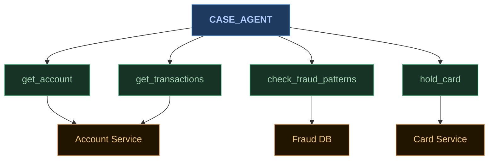
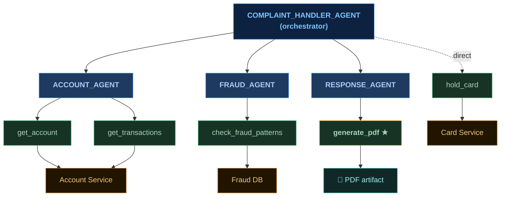
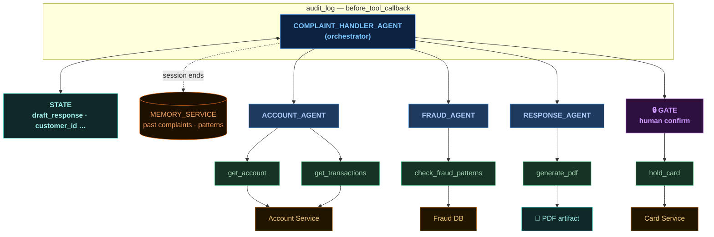
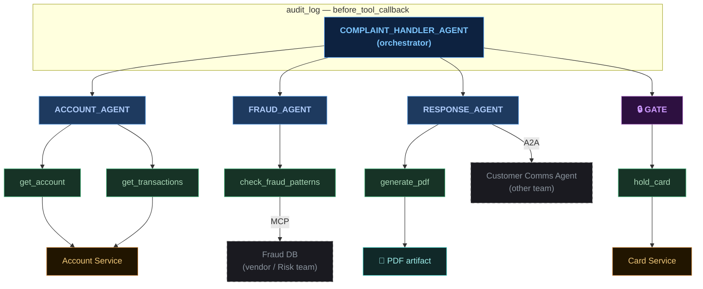
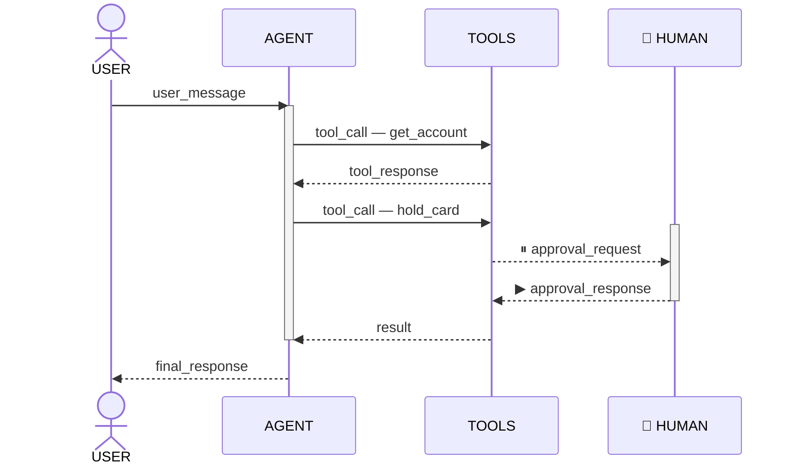

<div class="min-center">
  <p class="section-heading">Five problems</p>
  <p class="section-sub">tools &nbsp;·&nbsp; orchestration &nbsp;·&nbsp; callbacks &nbsp;·&nbsp; state &nbsp;·&nbsp; protocols</p>
</div>

---
class: problem-slide-wrap
---

<div class="title-bar">
  <span class="tb-l">P1 — Tools</span>
  <span class="tb-r">service calls / adapter pattern</span>
</div>



```python {8}
def hold_card(card_id: str, reason: str) -> dict:
    """Place a temporary hold on a card. Use when fraud is suspected."""
    return card_service.hold(card_id, reason)

case_agent = LlmAgent(
    model="gemini-2.5-flash",
    name="case_agent",
    tools=[get_account, get_transactions, check_fraud_patterns, hold_card],
)
```

---
class: problem-slide-wrap
---

<div class="title-bar">
  <span class="tb-l">P2 — Sub-agents</span>
  <span class="tb-r">service composition / saga</span>
</div>



```python {4}
complaint_handler_agent = LlmAgent(
    model="gemini-2.5-flash",
    name="complaint_handler",
    sub_agents=[account_agent, fraud_agent, response_agent],
    tools=[hold_card],
)
```

---
class: problem-slide-wrap
---

<div class="title-bar">
  <span class="tb-l">P3 — Callbacks</span>
  <span class="tb-r">AOP / interceptors / middleware</span>
</div>


```python {6,8,19}
# Cross-cutting: log every tool call. Callback shape.
def audit_tool_call(tool, args, tool_context):
    logger.info(f"{tool.name} called with {args}")

# Targeted: gate a specific tool on human approval.
@long_running_tool
def hold_card(card_id: str, reason: str):
    approval = yield {
        "type": "approval_request",
        "card_id": card_id,
        "reason": reason,
    }
    if not approval["approved"]:
        return {"status": "denied", "by": approval["user"]}
    return card_service.hold(card_id, reason)

complaint_handler_agent = LlmAgent(
    ...
    before_tool_callback=audit_tool_call,
    tools=[hold_card],
)
```

---
class: problem-slide-wrap
---

<div class="title-bar">
  <span class="tb-l">P4 — Sessions &amp; memory</span>
  <span class="tb-r">request scope / database</span>
</div>



```python {2,5-9}
# Inside a tool — short-term state for this conversation
tool_context.state["draft_response"] = text

# After resolution — keep what's useful next time
memory_service.add(
    customer_id=session.state["customer_id"],
    summary=session.state["resolution_summary"],
    tags=["fraud_hold", "disputed_transaction"],
)
```

---
class: dia-slide
---

<div class="title-bar">
  <span class="tb-l">P5 — Protocols</span>
  <span class="tb-r">designed for LLMs / OpenAPI for agents</span>
</div>



---
class: dia-slide
---

<div class="title-bar">
  <span class="tb-l">Events</span>
  <span class="tb-r">the bus underneath</span>
</div>



<div class="event-props">
  <span><b>observability</b> — every action is already logged</span>
  <span><b>persistence</b> — state is a projection of events</span>
  <span><b>resumability</b> — pause → persist → resume anywhere</span>
</div>
