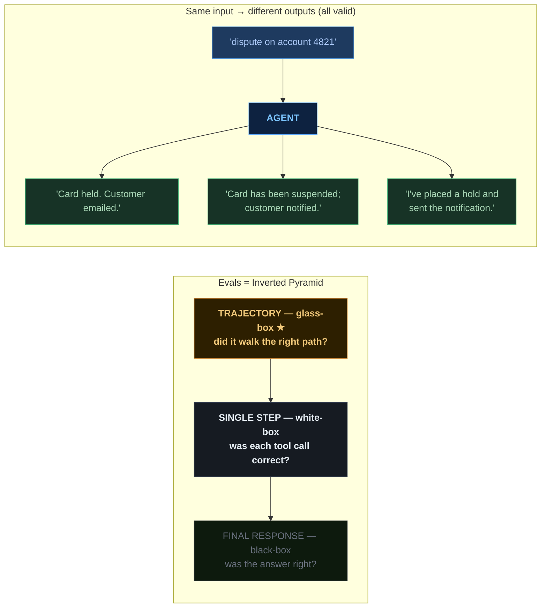
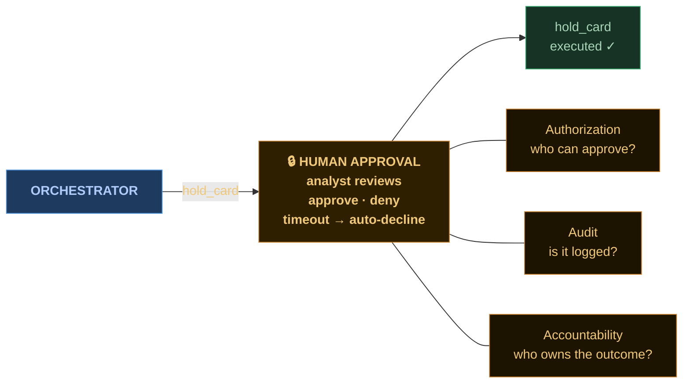

  
What's hard

  
not new problems — recalibrated ones

---
class: dia-slide
---

  Non-determinism &amp; evals
  distributed systems / testing pyramid

---
class: dia-slide
---

  Autonomy boundaries
  authorization

---
class: dia-slide
---

  Cost, latency, deployment
  sizing decisions

  

    
💰

    
Cost

    
CPU-hours

    
tokens

  

  

    
⏱

    
Latency

    
p99 of one call

    
a loop of N calls

  

  

    
🔁

    
Deployment

    
a service

    
a service that thinks

  

