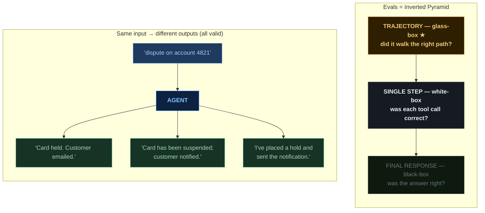
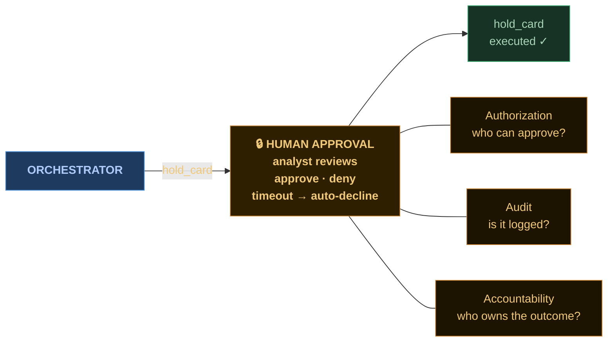

  
What's hard

  
not new problems — recalibrated ones

<!--
## CUE
- echo "same job" framing
- three honest recalibrations
- → first one

---

## FLOW
- Acknowledge the "same as before" framing from the deep-dive
- Signal honesty: three real recalibration points ahead
- → transition cue to slide 5.1

---

## SPOKEN
I just spent ten minutes telling you how much of this looks like things you already do. I meant it. But I'd be lying if I told you it's just the same job with different syntax. There are three places where the recalibration is real, and I want to be honest about each one.

None of these are reasons not to build agents. They're things you already know how to do, that you'll do slightly differently when there's a model in the loop.
-->

---
class: dia-slide
---

  C1 — Non-determinism &amp; evals
  distributed systems / testing pyramid

<!--
## CUE
- same input, different output
- distributed systems analogy
- black-box: final answer
- white-box: single step
- glass-box: trajectory (new)
- event stream = trajectory
- → autonomy next

---

## FLOW
- Introduce non-determinism: same input, different outputs, same outcome
- [gesture at top panel] Bridge to distributed-systems analogy; introduce "evals"
- [point at bottom] Bottom layer: final response / black-box
- [point at middle] Middle layer: single-step / white-box
- [point at top] Top layer: trajectory / glass-box — the new layer
- Callback: event stream from the deep-dive = what trajectory evals grade against
- → transition cue to slide 5.2

---

## SPOKEN
First one. Non-determinism. You give the agent the same input twice, you might get different output. Not different outcomes — different wording, different ordering. The card got held both times. The customer got notified both times. But the strings are different.

[gesture at top panel — beat]

You've seen this before. Distributed systems are non-deterministic. Network calls are non-deterministic. The playbook is the same: you don't test for one exact output, you test for properties that should hold across runs. The vocabulary in agent-land is evals. Evals are tests, but probabilistic.

Now — and this is the part I want you to remember from this slide — evals aren't just one thing. There's a pyramid. And it maps almost one-to-one onto the testing pyramid you already know.

[point at bottom — beat]

Bottom layer: final response. Black-box testing. You give the agent an input, you grade the final answer against a rubric. Did it answer the right thing? Did it stay within policy? This is the cheapest layer to write and the most superficial — and it's still necessary. Just not sufficient on its own.

[point at middle — beat]

Middle layer: single-step evals. White-box. You isolate one decision the agent made — say, the moment it chose to call check_fraud_patterns — and you grade that decision on its own. Did it pick the right tool? Did it pass the right arguments? This is the closest analog to a unit test in agent-land.

[point at top — beat]

Top layer — and this is the one that's genuinely new. Trajectory. Glass-box. Not 'is the final answer correct,' and not 'was each individual step correct' — but 'did the agent take the right path overall?' Did it call check_fraud_patterns before it called hold_card, or did it skip the check? Did it loop ten times when it should have looped twice? Did it pull the account, or did it hallucinate the customer ID?

Trajectory evals catch what the other two layers miss. The final response can look fine and every individual step can look defensible, but the agent took an expensive, wrong, or dangerous path to get there. If you only check the endpoints, you'll ship those failures.

Same pyramid you already know. Black-box at the bottom. White-box in the middle. Trajectory — the glass-box layer — on top. The discipline isn't new; the top layer is.

And — quick callback — remember the event stream from a moment ago? That's literally what you grade trajectory evals against. The events are the trajectory.
-->

---
class: dia-slide
---

  C2 — Autonomy boundaries
  authorization

<!--
## CUE
- gate = authorization
- auth, audit, accountability
- longer leash, higher stakes
- → cost & latency

---

## FLOW
- Name the card-hold gate for what it really is: authorization
- [point at three labels] Authorization, Audit, Accountability — same controls, shifted actor
- Connect leash length to gate importance; callback to coding assistants vs. complaint-handling agent
- → transition cue to slide 5.3

---

## SPOKEN
Second one. Autonomy boundaries. The card-hold gate we kept coming back to in the deep-dive — here's where I name what it actually is. It's authorization. It's the exact same question you ask every time you build any feature in this bank: who is allowed to do this thing, under what conditions, with what trail? Except the actor isn't a user clicking a button — it's an agent calling a tool.

[point at the three labels — beat]

Authorization. Audit. Accountability. Three things you already build into every sensitive endpoint. The vocabulary doesn't change. What changes is where the actor sits. When a user freezes a card, you have user IDs, session tokens, RBAC, the whole stack. When an agent freezes a card, you need the same controls, plus a human approval gate, plus a complete record of what the agent saw before it decided.

The recalibration here is: every place you would normally put an authorization check on a user, you might now also need one on an agent. And the more autonomous the agent — the longer the leash — the more these gates matter. We extended the leash on our coding assistants over two years because they can't actually move customer money. The leash on a complaint-handling agent at a bank lives forever in tension with the size of the action.

Long leash overall, short leash where it counts. That's the whole game.
-->

---
class: dia-slide
---

  C3 — Cost, latency, deployment
  sizing decisions

  

    
💰

    
Cost

    
CPU-hours

    
— tokens

  

  

    
⏱

    
Latency

    
p99 of one call

    
— a loop of N calls

  

  

    
🚀

    
Deployment

    
a service

    
— a service that thinks

  

<!--
## CUE
- same sizing, new variables
- cost: tokens not CPU
- latency: p99 of loop
- deployment: stateful, weirder
- you've done this already
- → show you one

---

## FLOW
- Frame all three as the same kind of thing: sizing decisions with shifted variables
- [point at cost] Cost: CPU-hours → tokens; scales with leash length
- [point at latency] Latency: single p99 → p99 of a loop; user feels the sum
- [point at deployment] Deployment: stateful, session-aware, weirder autoscaling
- Reassure: same disciplines, new variables; callback to dev assistant experience
- → Let me show you one.

---

## SPOKEN
Last one. Cost, latency, deployment. These I'm grouping because they're all the same kind of thing — sizing decisions you already make about any system, with the variables shifted.

[point at cost — beat] Cost: you used to count CPU-hours. Now you count tokens. And tokens scale with how long the conversation runs and how many tool calls happen inside one user request. A long-leashed agent costs more than a short-leashed one. That's not a problem; it's just a budget line you didn't have before.

[point at latency — beat] Latency: you used to look at p99 of a single API call. Now you're looking at p99 of a loop. Each turn of the loop is a model call, sometimes plus a tool call. Three turns means three latencies stacked. The user feels the sum.

[point at deployment — beat] Deployment: it's not quite a service the way you're used to. It's a service that thinks for a while between the request and the response. State has to live somewhere, sessions have to survive, and the autoscaling story is weirder than it is for a stateless web service.

None of these are new disciplines. They're the same questions you ask about any system, with new variables plugged in. You'll get used to the variables fast — most of you already have, in your dev assistant, where you've been making cost-versus-leash tradeoffs for two years whether you noticed or not.
-->
