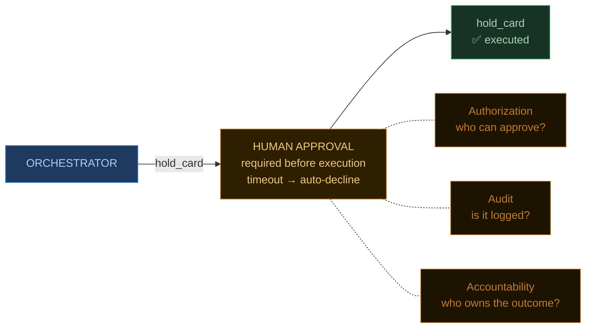

  
What's hard

  
not new problems — recalibrated ones

---

## Non-determinism &amp; evals

<EvalDiagram />

---

## Autonomy &amp; the three As

---

## Cost, latency, deployment

  

    
💰

    
Cost

    
one call, small cost

    
N steps × model calls — budget the loop before you build the feature

  

  

    
⏱

    
Latency

    
P50 in milliseconds

    
P95 in seconds — design retry budgets and timeouts from day one

  

  

    
🔁

    
Deployment

    
a stateless request handler

    
a long-running process — you need state, checkpoints, and a resume path

  

