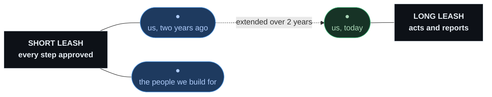

---
layout: center
---

  
"if you don't design silicon, you're not a full-stack developer"

  

    
if you don't ship agents, you're not a full-stack developer

  

---
layout: center
---

  
Thanks.

